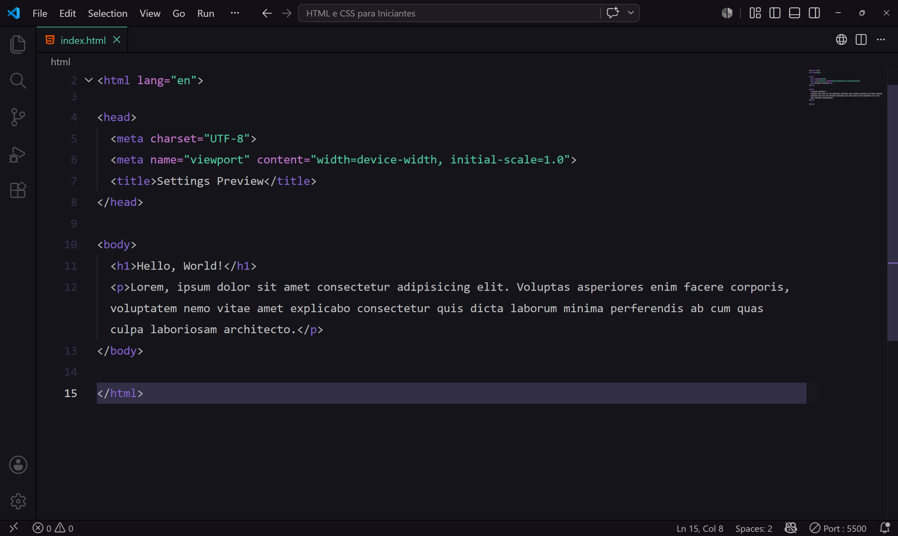

# VS Code Preferences ⚙️

This is the configuration for my personal **Visual Studio Code Workspace** (`settings.json`). The goal is to create a clean, distraction-free, and highly readable coding environment with a modern and minimalist design.

## Key Editor Choices 🎨

- **Color Palette**: Uses the `Aura Dark (Soft Text)` theme for a soothing, eye-friendly dark background.
- **Typography & Layout**: Font size is set to `16` with a line height of `1.75`, ensuring comfortable reading during long coding sessions. Tab size is kept at `2` for compact indentation. The entire interface zoom level is scaled up (`zoomLevel: 2`), and word wrap is enabled (`wordWrap: "on"`) to prevent horizontal scrolling.
- **Minimalism**: Minimap character rendering, bracket pair colorization, breadcrumbs (`breadcrumbs.filePath`), and outline icons (`outline.icons`) are all disabled to keep the editor interface ultra-clean and uncluttered.

## File Structure 📂

- **`settings.json`**: The main file defining all editor rules, formatting, and extension behaviors.
- **`preview.png`**: The screenshot showing the VS Code workspace.
- **`README.md`**: Documentation of the settings.

## Extensions & Tools 🛠️

- **Prettier (`esbenp.prettier-vscode`)**: Set as the default formatter for consistent code styling across projects.
- **Material Icon Theme**: Adds clean and recognizable icons to the file explorer.
- **Live Server**: Configured to run silently without intrusive information messages or tag verifications.
- **GitHub Copilot**: Explicitly disabled across all file types to maintain a fully manual coding experience.

## Features 🚀

- Fully **automated formatting** triggering instantly on save (`"editor.formatOnSave": true`).
- Enhanced **privacy** by completely turning off VS Code telemetry.
- Reduced noise with **smart quick suggestions** (disabled inside comments and strings).
- Custom HTML formatting rules using the native VS Code HTML language features.

## Installation & Usage 📥

1. Open Visual Studio Code.
2. Press `Ctrl + Shift + P` (or `Cmd + Shift + P` on macOS) to open the Command Palette.
3. Type and select **Preferences: Open User Settings (JSON)**.
4. Copy the contents of the `settings.json` file from this repository and paste them into your settings file.
5. Save the file and enjoy the new setup!

## Preview screenshot 👀📸

# Acknowledgments 🙏

 - Inspired by the constant pursuit of a more productive, clean, and customized development workflow. 

 - Feel free to explore the configurations, share any feedback or suggestions, and adapt them to your own needs. Don't forget, Jesus Loves You!
